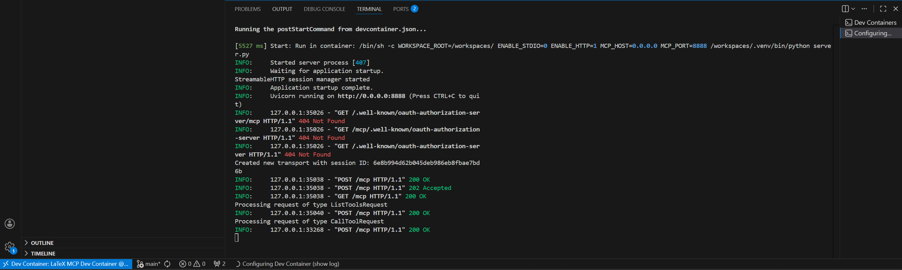
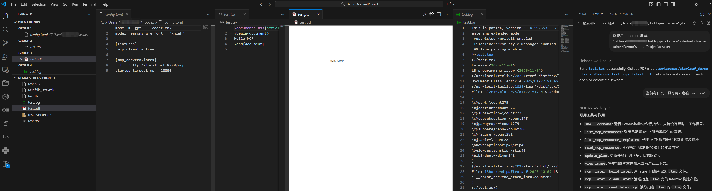

# LaTeX MCP Dev Container
在 Dev Container 里一键启动 LaTeX MCP，供 Codex 等远程编译/清理/读日志；DemoOverleafProject 已验证；沿用原 LaTeX 镜像，默认 HTTP 8888/关闭 STDIO

## 快速部署
1) 安装并运行 Docker Desktop，安装 VS Code + Dev Containers 扩展。
2) `git clone` 本仓库（或把 `.devcontainer/`、`requirements.txt`、`server.py` 复制到你的项目根）。
3) 用 VS Code 打开该目录，执行 “Dev Containers: Reopen in Container”：
   - 基础镜像自动拉取 `texlive/texlive:latest-doc-src`
   - postCreate：`apt-get install -y python3 python3-pip python3-venv`，创建 `/workspaces/.venv`，执行 `pip install -r requirements.txt`
   - postStart：`WORKSPACE_ROOT=/workspaces/ ENABLE_STDIO=0 ENABLE_HTTP=1 MCP_HOST=0.0.0.0 MCP_PORT=8888 /workspaces/.venv/bin/python server.py`
   - 结果：HTTP MCP 自动启动在 `http://0.0.0.0:8888/mcp`（已端口转发到宿主）
4) 另开 VS Code 窗口打开你的工程（如 `DemoOverleafProject`），注意路径用容器视角 `/workspaces/<repo>/...`。
5) 在 Codex CLI 配置 MCP：
   ```toml
   [features]
   rmcp_client = true

   [mcp_servers.latex]
   url = "http://localhost:8888/mcp"
   startup_timeout_ms = 20000
   ```
   现在可调用 `build_latex` / `clean_latex` / `read_latex_log`。

## MCP 工具
- `build_latex(file, engine=pdflatex|xelatex|lualatex)`: 调用 latexmk（`-synctex=1 -interaction=nonstopmode -file-line-error`，按 engine 选 `-pdf/-pdfxe/-pdflua`），返回编译日志并报告 PDF 是否生成。
- `clean_latex(file, mode=aux|all)`: `latexmk -c`（aux）或 `latexmk -C`（all，含 pdf），返回清理日志。
- `read_latex_log(file)`: 读取同目录下的 `.log`，若不存在会提示先 build。
- 所有工具都会强制校验路径在 `WORKSPACE_ROOT` 内。

## 环境变量（当前默认）
- `WORKSPACE_ROOT=/workspaces/`
- `MCP_HOST=0.0.0.0` / `MCP_PORT=8888`
- `ENABLE_STDIO=0` / `ENABLE_HTTP=1`（仅 HTTP；改为 1/1 可同时开两种传输）

## 路径规则
- 在容器内使用 `/workspaces/<repo>/...`，不要直接传宿主 Windows 路径。
- 示例：`C:\Users\name\Desktop\project_name\doc\main.tex` → `/workspaces/project_name/doc/main.tex`（或相对 `WORKSPACE_ROOT`）。
- 超出 `WORKSPACE_ROOT` 的路径会被拒绝。

## 其他
- VS Code 扩展：LaTeX Workshop、Vim、Better Comments、Trailing Spaces。
- Node 版本可参考 `jsversion_developping/server.mjs`，需要时自行添加 package.json 并 npm install。

## 最终效果
- Container 端：

- Tex开发端：
